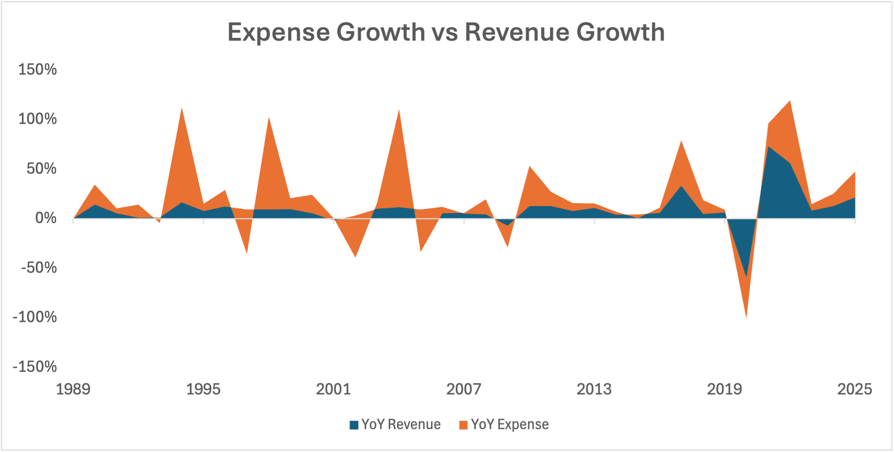

## Project Background

Despite consistent revenue growth, Alaska Air Group faces a **structural profitability crisis**. Revenue grew **15.5x** since 1989, yet net income grew only **2.3x**. Management lacks visibility into the underlying drivers of margin erosion, making it difficult to identify where costs are spiraling, why operating leverage has failed, and how to restore sustainable profitability.

Without structured analysis, the organization is unable to answer critical business questions such as:
- Why has net margin collapsed from 15.2% to 0.7% despite record revenue?
- Why does cost growth consistently outpace revenue growth?
- Why is the company achieving diseconomies of scale rather than economies of scale?
- Why does free cash flow remain negative despite positive operating cash flow?
- How did debt more than double to $6.9B, and what is the path to deleveraging?

#### **Overall Goal: Diagnose the root causes of profitability decline and provide actionable recommendations to stabilize cost structure, restore efficiency, and generate sustainable margin expansion.**

> **Note:** Detailed recommendations and implementation actions are consolidated in the final section of this report.

**A FULL official online detailed report for stakeholders and business leaders can be found [here](https://github.com/a-paija/Alaska-Air-Group-Financial-Report/blob/main/ALK_Financial_Diagnostic_Report.pdf)**

## Data Structure & Initial Checks

### Data Sources

Financial data was sourced from **public financial records** available on Alaska Air Group's Investor & Shareholder Relations website, including:

- **Income Statements** – Revenue, Cost of Revenue, Operating Expenses, Net Income
- **Cash Flow Statements** – Operating Cash Flow, Free Cash Flow, Capital Expenditures
- **Balance Sheets** – Total Debt, Interest Expense, Total Liabilities, Equity

### Data Processing & Cleaning (Power Query)

Raw financial statements were extracted and consolidated using **Excel and Power Query**. The following steps were performed to ensure data accuracy and consistency:

1. **Data Extraction:** Downloaded annual financial statements from Alaska Air Group's investor relations portal (10-K filings, annual reports) covering 1989–2025.

2. **ETL Process (Power Query):**
   - Imported raw data from multiple Excel files and PDF extracts
   - Combined income statements, cash flow statements, and balance sheets into a single master dataset
   - Standardized fiscal year-end dates to ensure alignment across statements
   - Removed duplicate records and merged fragmented datasets
   - Aggregated data at the annual level for consistent period-over-period comparison

3. **Data Cleaning:**
   - Handled missing values by cross-referencing with supplementary filings (10-Q, 8-K)
   - Standardized currency formatting to consistent units (USD)
   - Ensured consistent naming conventions and field definitions
   - Flagged outliers and anomalies for review (e.g., 2001 restructuring charges, 2020 pandemic-driven write-offs)

4. **Metric Calculation:** Derived key performance indicators including:
   - Net Margin = Net Income / Revenue
   - Operating Margin = Operating Income / Revenue
   - Gross Margin = (Revenue – Cost of Revenue) / Revenue
   - Cost per Revenue = Total Expenses / Revenue
   - Interest Coverage = EBIT / Interest Expense
   - Free Cash Flow = Operating Cash Flow – Capital Expenditures
   - YoY Revenue Growth and YoY Expense Growth

## Executive Summary

Alaska Air Group has grown revenue **15.5x** since 1989, from $917 million to $14.2 billion, and **130%** since 2021. Yet net income has multiplied only **2.3x** over 36 years, rising from $43 million to just $100 million, and has fallen **79%** in the last five. Net margin now sits at **0.7%**, down from 7.7%.

The company is scaling revenue but not scaling profit. The disconnect is driven by **five structural failures**:

1. **Cost Volatility & Control:**  Total costs remain highly unpredictable due to swings in Cost of Revenue and one-time items. Financial planning lacks a reliable foundation.

2. **Cost Efficiency Decline:** Cost per dollar of revenue has worsened 26% since 2015, from $0.76 to $0.96; the company is scaling inefficiency.

3. **No Operating Leverage:** Revenue has more than doubled since 2021, yet operating margin has fallen from 10.9% to 3.9%. Growth is delivering no efficiency benefit

4. **Margin Compression:** Net margin has collapsed from 15.2% to 0.7%, leaving the company with no margin for error; a 5% revenue decline would wipe out all profit.

5. **Escalating Debt Burden:** Debt has more than doubled to $6.9B, interest expense consumes 42% of operating income, and negative free cash flow forces the company to borrow further, creating a vicious cycle.

> **The company's primary constraint is not revenue generation, but the ability to convert revenue into sustainable profit due to structural cost inefficiencies, a lack of operating leverage, and a compounding debt burden.**

Addressing these gaps represents a significant opportunity to unlock near-term margin recovery while improving long-term financial sustainability.

## 1. Cost Volatility & Control

OpEx held at roughly **10% of revenue** since 2015. Cost of Revenue expanded from **56% to 86% of revenue** (1989–2025). Total expenses now consume **96% of revenue**, leaving a **4% operating margin**.

**Insight:** The company has controlled SG&A (Selling, General, and Administrative) costs but lost control of core delivery costs. The primary profit killer is Cost of Revenue, not operating expenses. At 96% expense-to-revenue ratio, the company has no margin for error.

## 2. Cost Efficiency Decline

Cost per revenue reached its best level in **2009 at $0.70**. Efficiency has since deteriorated **26% to $0.96 in 2025**.

**Insight:** Early improvements reflected successful cost controls. That progress has since reversed. The company is experiencing diseconomies of scale, growth brings higher unit costs rather than lower costs per unit.

## 3. No Operating Leverage

Expense growth outpaced revenue growth in **6 of 7 periods analyzed**. 

YoY expense swings: **+99% (2004)** , **-43% (2005)** , **+46% (2017)** , **-42% (2020)** .

**Insight:** Cost volatility is structural, not random. External shocks (2008, 2017, 2020) repeatedly disrupt the cost base. Financial planning lacks a reliable foundation because management cannot forecast total costs with confidence.

Operating margin: **3.9%** (2025). Net margin: **0.7%** (2025). Gap of **3.2 percentage points**. Gap has persisted across the period, averaging approximately **3 percentage points**.

**Insight:** Non-operating costs—interest, taxes, and one-time charges—consistently erode profitability beyond core operations. Even when operating performance improves, profit leaks through non-operating channels. The company cannot retain the value it creates.

## 4. Margin Compression

Net margin peaked at **15.15% (2015)** . Collapsed to **-37.13% (2020)** . Currently at **0.7% (2025)** . A **5% revenue decline** would eliminate all profitability.

**Insight:** Margin compression is structural, not cyclical. The 2020 shock exposed fragility, and the company has not recovered sufficient margin cushion since. At 0.7%, the company is operating with no buffer.

## 5. Escalating Debt Burden

Debt more than doubled since 2019: **$3.2B → $6.9B** (+115%). Interest expense nearly quadrupled: **$63M → $235M** (+273%). Interest consumes **42% of operating income**. Interest coverage: **1.6x** (2019: 17.1x). Free cash flow negative in **4 of the last 6 years**, including **-$339M (2025)** .

**Insight:** Debt is a compounding factor, not a separate problem. Each shock forces borrowing, and borrowing increases fixed obligations, making the company more vulnerable to the next shock. Negative free cash flow forces further borrowing—a self-reinforcing cycle. At 1.6x interest coverage, a modest earnings decline would push coverage below 1.0x.

## Root Cause Analysis

The five drivers are not isolated problems. They form a chain of causation where each driver compounds the next.

| Order | Driver | Root Cause |
|-------|--------|------------|
| **1** | Cost Volatility & Control | External shocks (2008, 2017, 2020) + structural sensitivity to fuel prices, integration costs, and demand disruptions |
| **2** | Cost Efficiency Decline | Shocks disrupt operational discipline; costs rise with scale rather than fall (diseconomies of scale) |
| **3** | No Operating Leverage | Revenue growth absorbed by rising costs; expense growth outpaces revenue growth in nearly every period |
| **4** | Margin Compression | Cumulative outcome of inefficiency and lack of leverage; net margin 15.2% → 0.7% |
| **5** | Escalating Debt Burden | Shocks force borrowing; debt amplifies fragility; interest consumes 42% of operating income |

## Recommendations

The following recommendations are prioritized based on potential financial impact and operational importance.

### Action 1: Stabilize Cost Structure

**Impact:** High | **Addresses:** Cost volatility and control gaps

- Identify the most volatile cost categories (fuel, maintenance, labor)
- Implement an enhanced fuel hedging program
- Diversify the supplier base to reduce concentration risk
- Build contingency buffers into operating budgets

### Action 2: Restore Cost Efficiency

**Impact:** High | **Addresses:** 26% efficiency decline since 2015

- Conduct cost-to-serve analysis
- Benchmark unit costs against industry peers
- Review procurement and vendor contracts
- Evaluate automation and process redesign opportunities

### Action 3: Generate Operating Leverage

**Impact:** High | **Addresses:** Revenue +130%, margins −7pp

- Ensure revenue growth outpaces cost growth
- Price selectively to improve unit economics
- Align capacity additions with cost efficiency targets

### Action 4: Reduce Debt Burden

**Impact:** High | **Addresses:** Debt +115%, interest consumes 42% of operating income

- Refinance high-cost debt
- Use excess cash/asset sales for paydown
- Restrict new borrowing
- Improve free cash flow through CapEx discipline

### Action 5: Build Margin Buffer

**Impact:** Medium | **Addresses:** 0.7% net margin with no buffer

- Target net margin above 5%
- Stress-test against historical shock scenarios
- Maintain liquidity reserves

## The Bottom Line

Fixing the cost structure is the prerequisite for all other improvements. Without it, revenue growth will continue to be absorbed by rising costs, and debt will continue to compound the problem.

Without decisive action, margin compression, negative cash flow, and rising debt will lead to a liquidity crisis within 3–5 years.

## Skills Demonstrated

- Financial Statement Analysis
- ETL / Data Cleaning (Power Query)
- Financial Modeling
- Data Visualization
- Business Storytelling
- Executive Reporting
  
## Tools Used

| Tool | Purpose |
|------|---------|
| **Excel** | Data consolidation, cleaning, metric calculation |
| **Power Query** | ETL: combining income statements, cash flow, and balance sheets |
| **Data Visualization** | Trend analysis, dual-axis charts, margin visualization |

**A FULL official online detailed report for stakeholders and business leaders can be found [here](https://github.com/a-paija/Alaska-Air-Group-Financial-Report/blob/main/ALK_Financial_Diagnostic_Report.pdf)**

